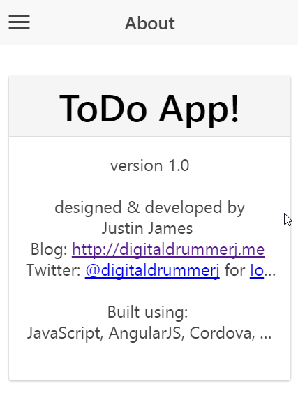

#Ionic Todo App Lab

In this lab we will be creating an application to store your Todo list.  

Objectives:

1. Get your machine setup for Ionic
2. Create a working application 

##Section 1: Setup

###Section 1.1: t Install Git (Windows Only)

The default Ionic templates are downloaded from git when you start a new project.

1. Download git at [https://git-scm.com/download/win](https://git-scm.com/download/win)
1. Run the installer and keep all of the defaults
1. After the install completes, open a command prompt and run the following command

		git --version

###Section 1.2: Install NodeJS

In this section we will be installign NodeJs is you do not have it already installed.  To check to see if you have node install or not, open a command prompt or terminal and run the following command:    
		
		$ node -v 

1. If you do not have nodejs installed, download it from [http://nodejs.org](http://nodejs.org)
1. After the installer downloads, run it and keep all of the defaults
1. To verify the node install, open a new command prompt or terminal and the run the following command:

		$ node -v

###Section 1.3: Configure Npm

We are going to turn off the npm spinner and turn on http messages so that you will be able to see that npm is actually doing something 

1. Open a Command Prompt or Terminal
1. Run the following commands:

		$ npm config set spin false
		$ npm config set loglevel http

1. Verify that the settings are set

		$ npm config ls

###Section 1.4: Installing Ionic
	
1. Install the following npm packages

		$ npm install -g ionic gulp bower  
   
1. Verify the installs by running the following commands

###Section 1.5: Installing a Text Editor

You can use any text editor to developer your ionic project.  I personally am using Visual Studio Code right now but any text editor will do.

* Visual Studio Code (free) - [https://code.visualstudio.com](https://code.visualstudio.com)
* Brackets (free) - [http://brackets.io](http://brackets.io)
* Webstorm (paid)  - [https://www.jetbrains.com/webstorm](https://www.jetbrains.com/webstorm)
* Sublime Text (paid) - [http://www.sublimetext.com](http://www.sublimetext.com) 

##Section 2: Creating the Project

In this section we will be creating the initial ionic project.
 
1. Open a command prompt or terminal
1. Navigate where you normally keep your source code.  I keep mine at c:\projects

		
		$ mkdir c:\projects
		$ cd c:\projects 

1. Run the ionic start command to create your project

		$ ionic start todoApp blank

1. You should see output like this screenshot if everything is working correctly.    
		
1. Running our todoApp

		$ cd todoApp && ionic serve 

1. You should see a web browser open and the page will look like the following
		

##Section 3: 
	

Steps:

* update index page
* Create tasks.html
* Create task modal
* Create project modal
* Add menu
* Add plug button
* dynamically create menu items
* Todo Controller
	* Add File
	* Get Project
	* Add Task
	* Update project display when new project is selected
	* Cancel New Task modal
* Menu Controller
	* Add File
	* Add Project
	* Select Project
	* cancel new project modal
	* Delete Project 
	* Show add project is no projects created
* Routing
	* Add task.html route
	* Add About route
